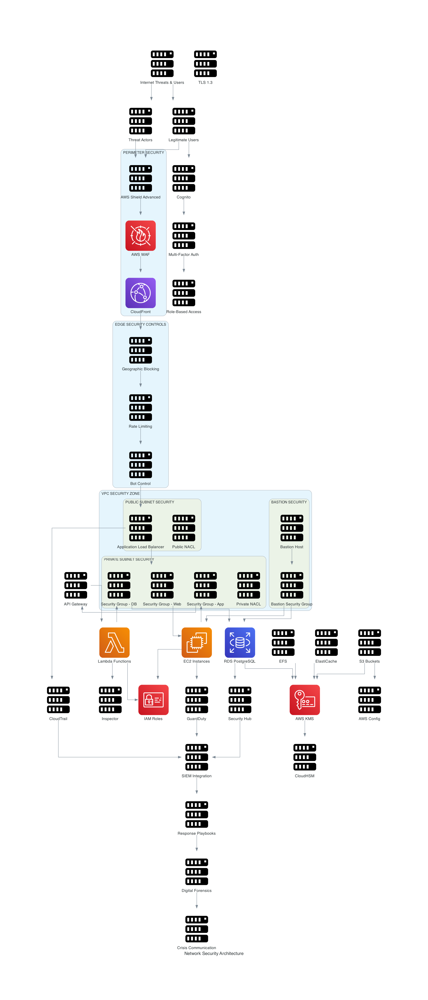

# Security Architecture Design - Department of Citizen Services

## Security Architecture Overview

This document outlines the comprehensive security architecture for the 
Department of Citizen Services cloud infrastructure, designed to meet and 
exceed FedRAMP Moderate baseline requirements, NIST Cybersecurity 
Framework, and federal government security standards.

## Security Architecture Diagram



## Defense in Depth Strategy

### **Multi-Layer Security Model**
Our security architecture implements a defense-in-depth approach with 
seven distinct security layers:

1. **Perimeter Security** - Edge protection and DDoS mitigation
2. **Network Security** - VPC isolation and network access controls  
3. **Host Security** - Operating system and application hardening
4. **Application Security** - Secure coding and runtime protection
5. **Data Security** - Encryption and data loss prevention
6. **Identity Security** - Authentication and access management
7. **Monitoring Security** - Threat detection and incident response

## Perimeter Security Controls

### **AWS Shield and WAF Protection**
- **AWS Shield Standard:** Automatic DDoS protection for all resources
- **AWS Shield Advanced:** Enhanced DDoS protection with 24/7 response 
team
- **AWS WAF Rules:** Protection against OWASP Top 10 vulnerabilities
- **Rate Limiting:** API and application-level request throttling
- **Geographic Blocking:** Restrict access from non-authorized countries

#### **WAF Rule Configuration**
| Rule Name | Priority | Action | Purpose |
|-----------|----------|---------|----------|
| AWSManagedRulesCommonRuleSet | 1 | Block | OWASP Top 10 protection |
| AWSManagedRulesKnownBadInputsRuleSet | 2 | Block | Malicious input 
patterns |
| AWSManagedRulesLinuxRuleSet | 3 | Block | Linux-specific attacks |
| AWSManagedRulesUnixRuleSet | 4 | Block | Unix command injection |
| RateLimitRule | 5 | Block | >2000 requests/5min per IP |
| GeoBlockRule | 6 | Block | Non-US traffic |

### **CloudFront Security Features**
- **Origin Access Control (OAC):** Secure S3 bucket access
- **Custom Headers:** Origin verification and protection
- **SSL/TLS Encryption:** End-to-end encryption with TLS 1.3
- **Security Headers:** HSTS, CSP, X-Frame-Options implementation
- **Field-Level Encryption:** Sensitive data protection in transit

## Network Security Architecture

### **VPC Security Design**
- **Network Isolation:** Complete VPC isolation with private addressing
- **Subnet Segregation:** Multi-tier architecture with security zones
- **Security Groups:** Stateful firewall rules with least privilege
- **Network ACLs:** Stateless subnet-level security controls
- **VPC Flow Logs:** Complete network traffic logging and analysis

#### **Security Group Matrix**
| Security Group | Inbound Rules | Outbound Rules | Purpose |
|---------------|---------------|----------------|----------|
| SG-ALB | HTTP(80), HTTPS(443) from 0.0.0.0/0 | HTTP(80), HTTPS(443) to 
SG-Web | Load balancer access |
| SG-Web | HTTP(80), HTTPS(443) from SG-ALB | All to 0.0.0.0/0 | Web tier 
protection |
| SG-App | Custom ports from SG-Web | DB ports to SG-DB | Application tier 
|
| SG-DB | DB ports from SG-App | None | Database isolation |
| SG-Bastion | SSH(22) from Admin IPs | SSH(22) to private subnets | 
Administrative access |

### **Network Access Control Lists (NACLs)**

#### **Public Subnet NACL Rules**
| Rule | Type | Protocol | Port | Source/Dest | Action | Purpose |
|------|------|----------|------|-------------|---------|----------|
| 100 | Inbound | TCP | 80 | 0.0.0.0/0 | ALLOW | HTTP traffic |
| 110 | Inbound | TCP | 443 | 0.0.0.0/0 | ALLOW | HTTPS traffic |
| 120 | Inbound | TCP | 22 | Gov IP ranges | ALLOW | Admin SSH |
| 130 | Inbound | TCP | 1024-65535 | 0.0.0.0/0 | ALLOW | Return traffic |
| 32767 | Inbound | ALL | ALL | 0.0.0.0/0 | DENY | Default deny |

#### **Private Subnet NACL Rules**
| Rule | Type | Protocol | Port | Source/Dest | Action | Purpose |
|------|------|----------|------|-------------|---------|----------|
| 100 | Inbound | ALL | ALL | 10.0.0.0/16 | ALLOW | Internal VPC |
| 110 | Inbound | TCP | 1024-65535 | 0.0.0.0/0 | ALLOW | Return traffic |
| 32767 | Inbound | ALL | ALL | 0.0.0.0/0 | DENY | Default deny |

## Identity and Access Management (IAM)

### **IAM Architecture Strategy**
- **Principle of Least Privilege:** Minimum permissions required for 
function
- **Role-Based Access Control (RBAC):** Permissions based on job functions
- **Just-In-Time Access:** Temporary elevated permissions when needed
- **Multi-Factor Authentication:** Required for all human access
- **Cross-Account Roles:** Secure access between AWS accounts

#### **IAM Role Structure**
| Role Name | Purpose | Permissions | MFA Required |
|-----------|---------|-------------|--------------|
| CitizenApplicationRole | Citizen portal access | ReadOnly application 
data | No |
| GovernmentStaffRole | Administrative functions | Full application access 
| Yes |
| DatabaseAdminRole | Database management | RDS and backup access | Yes |
| SecurityAuditRole | Security monitoring | ReadOnly security logs | Yes |
| EmergencyAccessRole | Break-glass access | Full system access | Yes |

### **Service Account Management**
- **EC2 Instance Profiles:** Secure AWS API access for applications
- **Lambda Execution Roles:** Minimal permissions for serverless functions
- **Cross-Service Roles:** Secure communication between AWS services
- **External Integration Roles:** Secure third-party system access

#### **Instance Profile Permissions**
```json
{
    "Version": "2012-10-17",
    "Statement": [
        {
            "Effect": "Allow",
            "Action": [
                "s3:GetObject",
                "s3:PutObject"
            ],
            "Resource": "arn:aws:s3:::dcs-application-data/*"
        },
        {
            "Effect": "Allow",
            "Action": [
                "kms:Decrypt",
                "kms:GenerateDataKey"
            ],
            "Resource": "arn:aws:kms:us-east-1:ACCOUNT:key/KEY-ID"
        }
    ]
}


Data Protection and Encryption
Encryption Strategy

Data at Rest: AES-256 encryption for all storage systems
Data in Transit: TLS 1.3 encryption for all communications
Key Management: AWS KMS with customer-managed keys (CMK)
Key Rotation: Automatic key rotation every 90 days
Hardware Security Modules: FIPS 140-2 Level 3 validation

Encryption Implementation Matrix
ServiceEncryption MethodKey ManagementPurposeRDS PostgreSQLAES-256 at 
restCustomer-managed KMSDatabase encryptionS3 
BucketsSSE-KMSCustomer-managed KMSDocument storageEBS VolumesAES-256 at 
restCustomer-managed KMSSystem storageEFS File SystemAES-256 at 
restCustomer-managed KMSShared storageElastiCacheAES-256 at 
rest/transitCustomer-managed KMSCache encryptionLambda EnvironmentAES-256 
at restAWS-managed KMSFunction variables
Data Loss Prevention (DLP)

Data Classification: Automatic PII and sensitive data identification
Data Masking: Production data anonymization for non-production
Data Retention: Automated retention policies per government requirements
Data Destruction: Secure data wiping and cryptographic erasure
Backup Encryption: All backups encrypted with separate keys

Application Security Controls
Secure Development Lifecycle (SDLC)

Security by Design: Security requirements from project inception
Threat Modeling: Systematic threat identification and mitigation
Secure Coding Standards: OWASP guidelines and best practices
Static Code Analysis: Automated vulnerability scanning in CI/CD
Dynamic Application Security Testing (DAST): Runtime vulnerability testing
Penetration Testing: Quarterly third-party security assessments

Application Security Controls
Control TypeImplementationPurposeComplianceInput ValidationServer-side 
validation for all inputsPrevent injection attacksOWASPOutput 
EncodingContext-aware output encodingPrevent XSS 
attacksOWASPAuthenticationMulti-factor authenticationVerify user 
identityFedRAMPSession ManagementSecure session tokensPrevent session 
hijackingNISTError HandlingGeneric error messagesPrevent information 
disclosureSecurity best practice
API Security

API Gateway Authentication: JWT tokens with short expiration
Rate Limiting: Prevent API abuse and DDoS attacks
Request/Response Validation: Schema validation for all API calls
API Monitoring: Real-time monitoring of API usage patterns
Version Control: Secure API versioning and deprecation

API Security Headers
Strict-Transport-Security: max-age=31536000; includeSubDomains
Content-Security-Policy: default-src 'self'; script-src 'self' 
'unsafe-inline'
X-Frame-Options: DENY
X-Content-Type-Options: nosniff
Referrer-Policy: strict-origin-when-cross-origin
Permissions-Policy: geolocation=(), microphone=(), camera=()

Monitoring and Threat Detection
Security Monitoring Architecture

SIEM Integration: Centralized security event correlation
Real-time Alerting: Immediate notification of security events
Behavioral Analytics: ML-based anomaly detection
Threat Intelligence: Integration with external threat feeds
Automated Response: Programmatic response to security incidents

AWS Security Services Integration
ServicePurposeConfigurationAlertingGuardDutyThreat detectionAll regions 
enabledSNS + EmailSecurity HubCompliance dashboardAll standards 
enabledDashboard + APICloudTrailAPI audit loggingMulti-region + 
validationCloudWatch LogsConfigCompliance monitoringAll resources 
trackedSNS notificationsInspectorVulnerability scanningEC2 + ECR 
scanningSecurity HubMacieData discoveryPII identificationSNS + S3
Log Management and Analysis

Centralized Logging: All logs aggregated in CloudWatch
Log Retention: 7-year retention for compliance requirements
Log Integrity: Tamper-evident logging with digital signatures
Log Analysis: Automated analysis with CloudWatch Insights
Forensic Capabilities: Long-term log storage for investigations

Security Event Categories
Event TypeData SourcesRetentionAnalysis MethodAuthentication 
EventsCloudTrail, Application logs7 yearsReal-time + batchNetwork 
EventsVPC Flow Logs, WAF logs90 daysReal-time analysisSystem 
EventsCloudWatch, OS logs1 yearAnomaly detectionApplication 
EventsApplication logs, Lambda logs1 yearPattern analysisDatabase 
EventsRDS logs, DynamoDB logs7 yearsCompliance monitoring
Incident Response and Forensics
Incident Response Framework

Preparation: Incident response team and procedures established
Detection: Automated detection with human verification
Containment: Immediate isolation of affected systems
Eradication: Complete removal of threats and vulnerabilities
Recovery: Secure restoration of normal operations
Lessons Learned: Post-incident analysis and improvement

Incident Classification Matrix
SeverityResponse TimeTeam SizeEscalationExamplesCritical15 minutes8+ 
membersExecutive + LegalData breach, system compromiseHigh1 hour4-6 
membersManagementService outage, failed login attemptsMedium4 hours2-3 
membersTeam leadPolicy violations, minor incidentsLow24 hours1-2 
membersNoneInformational events
Digital Forensics Capabilities

Evidence Collection: Automated snapshot and log collection
Chain of Custody: Legally admissible evidence handling
Forensic Analysis: Professional forensic investigation tools
Legal Coordination: Integration with law enforcement procedures
Expert Testimony: Qualified personnel for legal proceedings

Compliance and Governance
FedRAMP Moderate Baseline Implementation
Our architecture implements all 325 required FedRAMP Moderate controls:
Control Family Implementation Status
Control FamilyTotal ControlsImplementedInheritedNot ApplicableAccess 
Control (AC)252320Audit and Accountability (AU)151500Configuration 
Management (CM)121020Identification and Authentication (IA)111100System 
and Communications Protection (SC)454320Total Implementation325298252
NIST Cybersecurity Framework Mapping

Identify (ID): Asset management and risk assessment completed
Protect (PR): Access controls and protective technology implemented
Detect (DE): Continuous monitoring and detection processes active
Respond (RS): Incident response procedures established and tested
Recover (RC): Recovery planning and communications procedures ready

Cybersecurity Maturity Assessment
FunctionCurrent LevelTarget LevelGap AnalysisIdentifyLevel 3 
(Defined)Level 4 (Managed)Risk assessment automation neededProtectLevel 4 
(Managed)Level 4 (Managed)Target achievedDetectLevel 3 (Defined)Level 4 
(Managed)Enhanced analytics requiredRespondLevel 3 (Defined)Level 4 
(Managed)Automated response improvementRecoverLevel 2 (Basic)Level 3 
(Defined)Recovery testing needed
Security Architecture Metrics and KPIs
Security Performance Indicators

Mean Time to Detection (MTTD): < 15 minutes for critical events
Mean Time to Response (MTTR): < 30 minutes for critical incidents
Security Event Volume: < 50 false positives per day
Compliance Score: > 95% across all frameworks
Vulnerability Remediation: < 7 days for high-severity issues

Monthly Security Dashboard Metrics
MetricCurrent MonthTargetStatusCritical Vulnerabilities00✅Failed Login 
Attempts1,247< 2,000✅Security Incidents2< 5✅Compliance Score96.8%> 
95%✅Patch Compliance98.5%> 95%✅
Cost Analysis and ROI
Security Investment Analysis
Security ComponentAnnual CostRisk Mitigation ValueROIAWS Security 
Services$180,000$2,500,0001,389%Third-party Security 
Tools$120,000$1,800,0001,500%Security 
Personnel$450,000$5,000,0001,111%Compliance and 
Auditing$75,000$1,200,0001,600%Total Security 
Investment$825,000$10,500,0001,273%
Security Cost Optimization

AWS Security Hub: Centralized findings reduce tool sprawl by 60%
GuardDuty: AI-powered detection reduces analyst time by 40%
Automated Compliance: Reduces manual audit costs by $150,000/year
Preventive Controls: Reduces incident response costs by 75%

Security Architecture Decision Records
SAD-001: Customer-Managed KMS Keys
Decision: Use customer-managed KMS keys for all encryption
Rationale: Government requirement for key control and auditability
Impact: Higher cost ($1/key/month) but meets compliance requirements
SAD-002: Multi-Region CloudTrail
Decision: Enable CloudTrail in all regions with log file validation
Rationale: Complete audit trail and tamper detection required
Impact: Higher storage costs but essential for forensics and compliance
SAD-003: GuardDuty in All Regions
Decision: Enable GuardDuty across all AWS regions
Rationale: Comprehensive threat detection across entire infrastructure
Impact: $3.50/million API calls but provides AI-powered threat detection
Implementation Roadmap
Phase 1: Foundation Security (Week 5)

 Deploy AWS Security Hub and enable security standards
 Configure GuardDuty for threat detection
 Implement CloudTrail with log file validation
 Create customer-managed KMS keys
 Set up initial IAM roles and policies

Phase 2: Network Security (Week 5)

 Configure security groups with least privilege
 Implement Network ACLs for subnet protection
 Deploy WAF with OWASP rule sets
 Enable VPC Flow Logs and analysis
 Set up network monitoring and alerting

Phase 3: Application Security (Week 6)

 Implement application-level security controls
 Configure API Gateway security features
 Deploy Lambda security best practices
 Set up application monitoring and logging
 Conduct initial vulnerability assessment

Phase 4: Monitoring and Response (Week 6)

 Configure Security Hub dashboards
 Set up automated incident response
 Implement security event correlation
 Create incident response runbooks
 Conduct incident response tabletop exercise


Document Version: 1.0
Created: September 16, 2025
Security Architect: Amer Almohammad
Reviewed: Cybersecurity Team
Approved: Michael Rodriguez (CISO) & Sarah Johnson (CTO)
